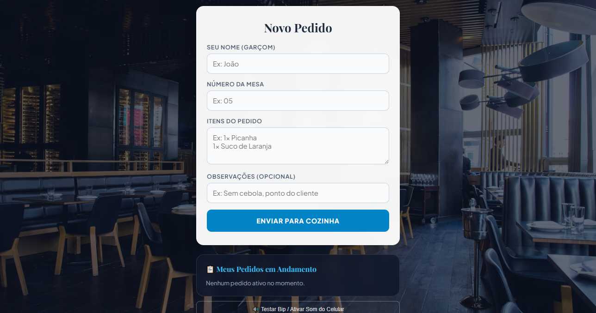
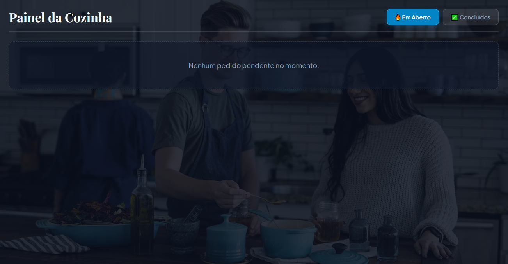

# 🍽️ Sistema de Comandas & Pedidos em Tempo Real (Garçom ↔ Cozinha)

Um aplicativo web *full-stack* desenvolvido em tempo real para otimizar o fluxo de atendimento em restaurantes, lanchonetes e bares. O sistema conecta garçons (via dispositivos móveis) diretamente ao painel da cozinha, garantindo previsibilidade, histórico de comandas e notificações em tempo real.


---

## 📸 Demonstração do Sistema

| Tela do Garçom (Mobile) | Painel da Cozinha (Desktop) |
| :---: | :---: |
|  |  |

---

## 🚀 Funcionalidades Principais

### 📱 Módulo do Garçom (`garcom.html`)
* **Lançamento Rápido de Pedidos:** Entrada para número da mesa, itens da comanda e observações específicas ("sem cebola", "ponto da carne", etc.).
* **Memória do Dispositivo:** Armazenamento automático do nome do garçom (`localStorage`) para evitar digitação repetitiva.
* **Fila Dinâmica de Pedidos:** Acompanhamento do status de cada pedido em tempo real (`⏳ Na Fila` vs `👨‍🍳 Em Preparo`).
* **Cancelamento Seguro:** Permite o cancelamento de pedidos enquanto estiverem "Na Fila" (bloqueio automático assim que a cozinha inicia o preparo).
* **Notificações Exclusivas:** Avisos sonoros (**Web Audio API**) e vibração no celular (**Vibration API**) direcionados **apenas** para o garçom responsável pelo pedido concluído.

### 👨‍🍳 Módulo da Cozinha (`cozinha.html`)
* **Fluxo em 2 Etapas:** Transição clara dos estados da comanda (`Em Aberto` ➔ `Em Preparo` ➔ `Concluído`).
* **Alerta Visual de Atraso:** Cronômetro individual por pedido. Pedidos que ultrapassam **15 minutos** acionam um indicador visual de alerta em vermelho e animação de pulso.
* **Alertas Sonoros:** Notificação em áudio a cada novo pedido recebido.
* **Histórico & Navegação por Abas:** Alternância rápida entre comandas ativas e histórico completo de pedidos concluídos.

### ⚙️ Backend e Infraestrutura (`server.js`)
* **Comunicação Bidirecional:** WebSockets via **Socket.io** com suporte nativo para múltiplos dispositivos móveis conectados simultaneamente.
* **Persistência de Dados (Zero Loss):** Salvamento automático de transações em arquivo JSON local (`db.json`), garantindo recuperabilidade total em caso de reinicialização ou queda de energia.
* **Acesso Externo Facilitado:** Configurado para roteamento em redes externas e tunelamento remoto (ex: *VS Code Dev Tunnels*).

---

## 🛠️ Tecnologias Utilizadas

* **Backend:** Node.js, Express.js, Socket.io, File System (FS).
* **Frontend:** HTML5, CSS3 (Design Responsivo, Glassmorphism, Flexbox e CSS Grid), JavaScript Vanilla.
* **APIs do Navegador:** Web Audio API (geração sintética de frequências de áudio) e Vibration API.
* **Persistência:** JSON Database.

---

## 📁 Estrutura do Projeto

```text
├── server.js              # Servidor HTTP e lógica do Socket.io
├── db.json                # Banco de dados local em JSON (criado automaticamente)
├── package.json           # Dependências do projeto
├── img/                   # Imagens de demonstração do sistema
│   ├── garcom.png
│   └── cozinha.png
└── public/
    ├── garcom.html        # Interface do aplicativo móvel para garçons
    └── cozinha.html       # Interface do painel de controle da cozinha